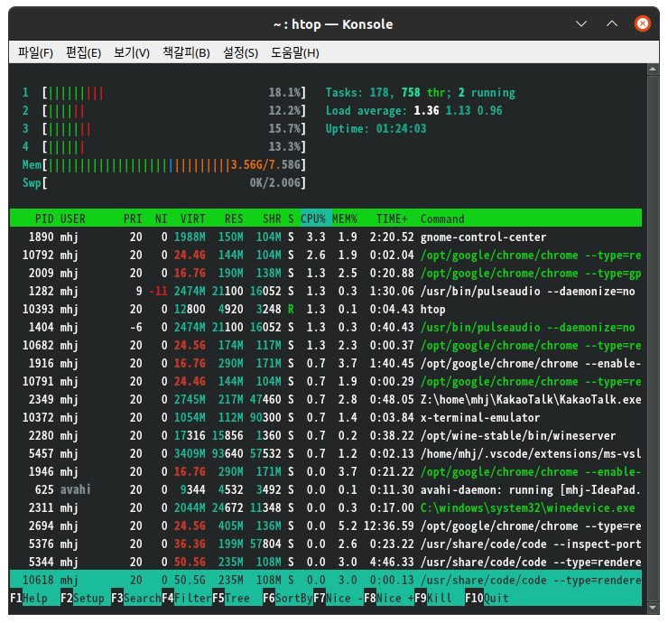

# Process_02

## PS

'ps' is short for process. Use ps to find out which files are currently running on your computer.

```r
mhj@mhj-IdeaPad:~$ ps
PID TTY          TIME CMD
5732 pts/0    00:00:00 bash
9607 pts/0    00:00:00 ps
```
As long as you type ps, you don't show programs running in the background. It only outputs the command ps currently entered and bash, the name of the shell I am currently using. If you want to print out all the programs in the background, you can do it as follows.
```r
mhj@mhj-IdeaPad:~$ ps aux
USER         PID %CPU %MEM    VSZ   RSS TTY      STAT START   TIME COMMAND
root           1  0.0  0.1 167572 11360 ?        Ss   15:18   0:00 /sbin/init splash
root           2  0.0  0.0      0     0 ?        S    15:18   0:00 [kthreadd]
root           3  0.0  0.0      0     0 ?        I<   15:18   0:00 [rcu_gp]
 etc ... 
```
This leads to numerous files, and if you want to search for only the files with the name you want, you can use the following method.
```r
mhj@mhj-IdeaPad:~$ ps aux | grep zoom
mhj        10163  0.0  0.0   6052  1524 ?        S    16:33   0:00 /usr/bin/zoom
mhj        10166  5.8  2.3 2163308 182992 ?      SLl  16:33   0:00 /opt/zoom/zoom
mhj        10220  0.0  0.0  10360   724 pts/0    S+   16:33   0:00 grep --color=auto zoom
```
At this time, the top PID represents the 'Process ID', and through this ID, we can take various actions. For example, a specific process may be forcibly terminated using 'kill'.
```r
mhj@mhj-IdeaPad:~$ sudo kill 10166
mhj@mhj-IdeaPad:~$ ps aux | grep zoom
mhj        10293  0.0  0.0  10360   660 pts/0    S+   16:35   0:00 grep --color=auto zoom
```
In this way, it can be seen that the process was forcibly terminated.


## HTOP

PS has the disadvantage that it is difficult for users to recognize because it looks so CLI-like. That's why we're going to use htop. Although htop is clearly a CLI-based system, it is easy for users to recognize because it shows a design similar to a GUI.

Let's briefly learn how to use htop.
)
- If you click CPU, MEM, etc., it appears sorted based on it.
-__TIME+_ means the time when the program is executed.
- In the case of Command, it shows what command the process was executed.
- In the case of MEM, the percentage occupying memory is shown as %, and in the case of RES, the actual size of memory occupied is shown.
- In the top toolbar, 1, 2, 3, and 4 each mean cpu, showing the current usage of cpu.
- Load average shows cpu share.

### Load average 

To find out more about Load average here, the first number represents the cpu share for 1 minute, the second number represents the cpu share for 5 minutes, and the last number represents the cpu share for 15 minutes.

See Load average in the picture.

Load average:|1.36|1.13|0.96|
|------|---|---|---|
|N Minute cpu Share|1 Minute|5 Minute|15 Minute|

A brief look at the meaning of this number is that if the cpu core is one, if the cpu share is 4, then cpu is currently running one process, and three processes are waiting to run. If the cpu core is 4 and the cpu share is 4, it can be understood as a very appropriate state because each core is in charge of one process.

For reference, if you press f4 on the htop screen, the filter turns on, and if you say chrome, it shows only processes related to chrome.
