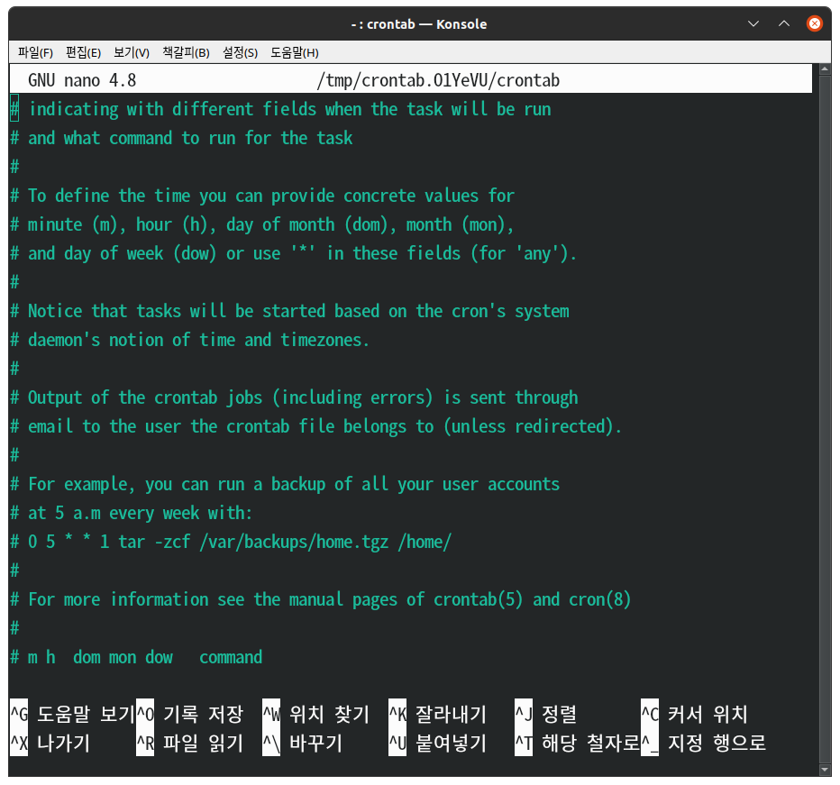

# Cron_01

Cron is a software that regularly executes certain commands. There can be many kinds of 'some orders'. For example, there may be instructions such as regularly backing up certain data, regularly sending certain data to someone, or periodically receiving computer time from the Internet. When you have to do something regularly in this way, you can regularly execute the command through the Cron.
## Crontab
 
To look at the Cron, if you give the following command, you will ask which editor to use, so you can choose a convenient one.

```
mhj@mhj-IdeaPad:~$ crontab -e
no crontab for mhj - using an empty one

Select an editor.  To change later, run 'select-editor'.
1. /bin/nano        <---- easiest
2. /usr/bin/vim.basic
3. /usr/bin/vim.tiny
4. /usr/bin/code
5. /bin/ed

Choose 1-5 [1]: 1
```

 
So if you write it down right here when we want to do something regularly, a program called cron will work and perform it.

Then, how do you write down the command? It is kindly shown in the comment at the bottom of crontab.
`# m h  dom mon dow   command` 

|keywords|m|h|dom|mon|dow|
|--------|-|-|---|---|---|
|abbreviation|minute|hour|day of month|month|day of week|
|range|0~59|0~23|1~31|1~12|0~6|
|explanation|If you write `10`, it means that it operates every hour in 10 minutes, and if you write `*/10`, it means that it operates every 10 minutes.|If `*` is put in the hour position, it means that it is executed regardless of hour. However, if `10 1` is written in this way, it means that it will be executed at 1:10 every day.|If `20`, it means that it will be executed on the 20th of every month, and if `*`, it will be executed regardless of the date.|It literally serves to tell you what month to run. If `10`, it means it only executed in October.|It means the day of the week. If it says `0`, it means it runs every Sunday.|

Then let's use this. Let's issue a command to store it in the log every minute using the 'date' function that informs the current time.

`*/1 * * * * date >> date.log`

And to ensure that this command is executed properly, you can issue the following command.

```
mhj@mhj-IdeaPad:~$ tail -f  date.log
2021. 12. 05. (일) 18:37:01 KST
2021. 12. 05. (일) 18:38:01 KST
2021. 12. 05. (일) 18:39:01 KST
2021. 12. 05. (일) 18:40:01 KST
2021. 12. 05. (일) 18:41:01 KST
    ...
```

In this way, the date.log is monitored by a program called tail, and when content is added to the back of the text, it automatically outputs the text, resulting in the above output results.

*** 

Here, what if the executed command encounters an error? Since the occurrence of an error is a standard error, not a standard output, the output method is different.

> [stdout, stderr](https://github.com/MinhoJJang/Linux_study/blob/main/11-13_IO%20Redirection/11_IO%20Redirection_01_(output).md)

If you just write 'date>>date.log' like this, there is no way we can know when the command 'date' occurs an error. Therefore, the error may be stored in the data.log by applying redirection as follows.

`date >> date.log 2>&1`

In this way, Cron is a program that plays a very important role in managing our system.