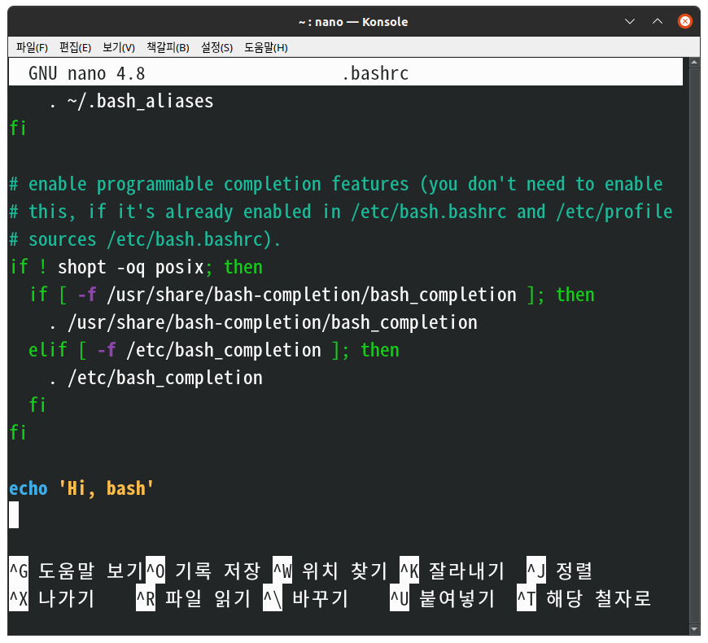
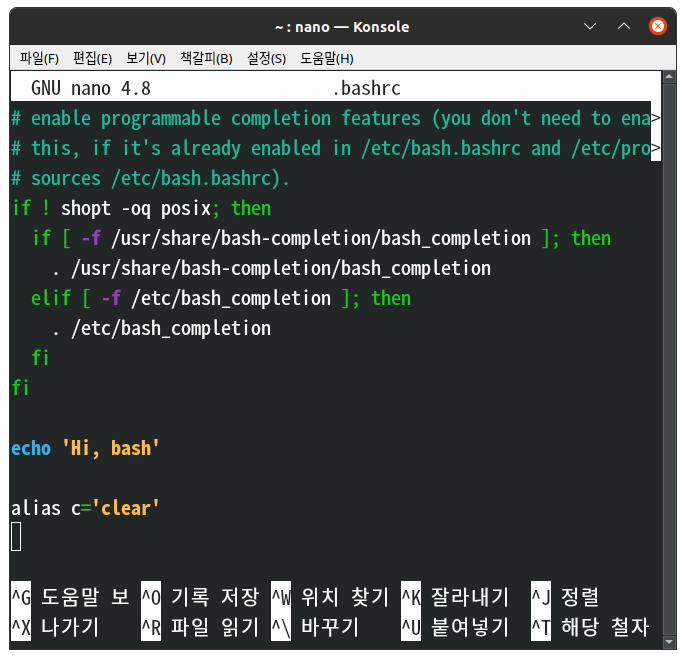

# Startup script bashrc

쉘이 시작했을 때 어떤 특정한 명령어가 자동으로 실행되도록 하는 방법에 대해 알아보자. 이것을 `쉘 스타트업 설정` 혹은 `쉘 스타트업 스크립트` 라고 부른다. 

## alias

이 키워드는 다음과 같이 다른 명령어에 별명을 붙여주는 역할을 한다. 
```
mhj@mhj-IdeaPad:~$ alias l='ls -al'
mhj@mhj-IdeaPad:~$ l
합계 118428
drwxr-xr-x 42 mhj  mhj       4096 12월  5 18:37 .
drwxr-xr-x  3 root root      4096 11월  1 23:37 ..
-rw-------  1 mhj  mhj         56 10월 20 22:57 .Xauthority
-rw-rw-r--  1 mhj  mhj        111 12월  5 10:15 .apport-ignore.xml
-rw-------  1 mhj  mhj      26151 12월  5 19:00 .bash_history
```
이처럼 alias를 통해 자주 사용하는 명령에 대해 별명을 붙여줄 수 있다. 
```
mhj@mhj-IdeaPad:~$ alias c='clear'
mhj@mhj-IdeaPad:~$ c
 ...
mhj@mhj-IdeaPad:~$
```

하지만, alias 명령은 그 콘솔창에서만 유효하기 때문에 alias를 실행한 콘솔창이 닫히면 다시 alias를 설정해주어야 한다. 따라서 우리가 콘솔을 닫고, 컴퓨터를 재부팅해도 그 별명을 사용하기 위해서는 **콘솔이 시작할 때마다 alias 명령어를 자동으로 실행해주는 프로그램**이 필요할 것이다. 이것이 바로 `쉘 스크립트 스타트업` 이다. 

쉘 스크립트 설정을 위해서는 아래와 같이 자신의 홈 디렉토리에 위치한 `.bashrc` 라는 파일에 들어가야 한다. 그리고 그 파일 안에서 간단한 출력 문구를 작성하고 빠져나온 뒤 bash를 다시 실행시키면 아래와 같은 결과가 나온다. 
```
mhj@mhj-IdeaPad:~$ nano .bashrc
```

```
Hi, bash
mhj@mhj-IdeaPad:~$ 
```

즉, `.bashrc` 파일의 밑에 내가 실행시키고 싶은 명령어를 작성하면 된다. 

c를 clear처럼 사용하기 위해 `.bashrc` 에서 수정하면 다음과 같은 결과가 나온다. 


```
mhj@mhj-IdeaPad:~$ nano .bashrc
mhj@mhj-IdeaPad:~$ c
 ...
mhj@mhj-IdeaPad:~$
```